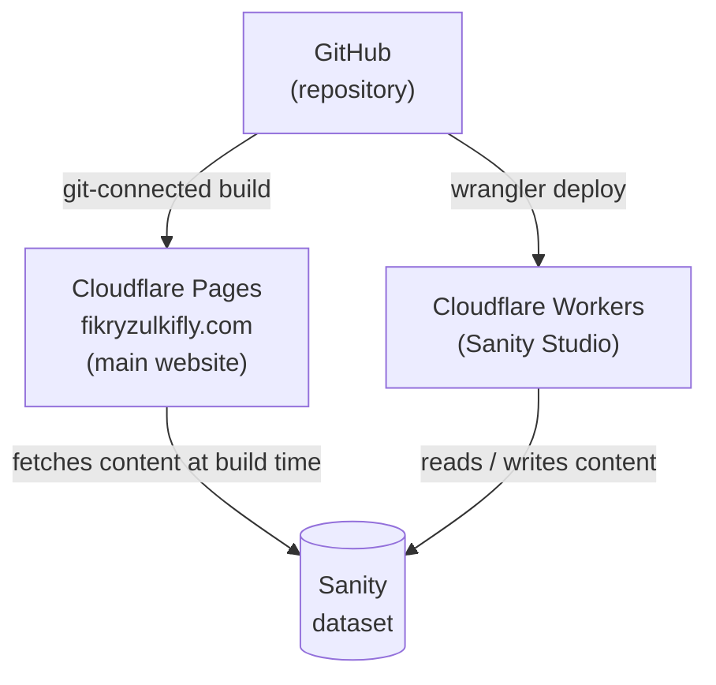
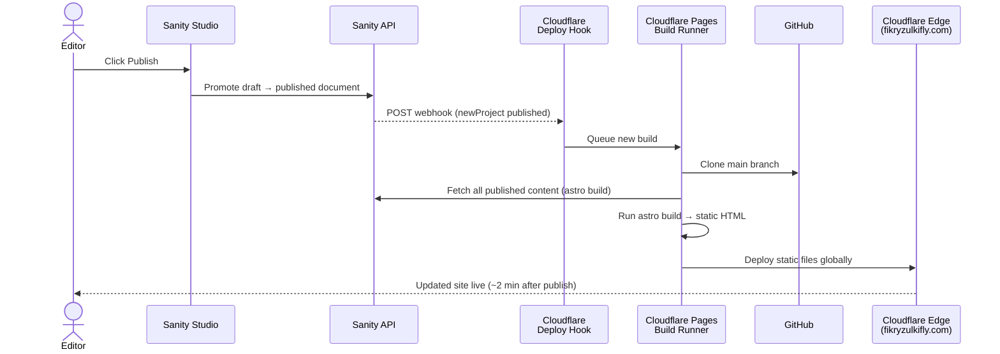

# Architecture

## Infrastructure

Two separate Cloudflare deployments, both driven from the same GitHub repository.

| Deployment | URL | Platform | How deployed |
|---|---|---|---|
| Main website | fikryzulkifly.com | Cloudflare Pages | Git-connected (auto-builds on push to `main`) |
| Sanity Studio | (internal URL) | Cloudflare Workers | `wrangler deploy` (manual) |

The main website is a **static site** — all pages are pre-rendered at build time using content fetched from Sanity. There is no runtime data fetching; the built HTML is served directly from Cloudflare's edge network.

---

## Content publishing flow

When a document is published in Sanity Studio, the main website automatically rebuilds and redeploys.

